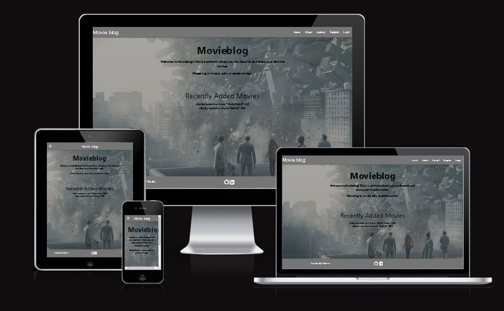

# CRUD movieblog

## Milestone Project 3

### I have created this web page as a part of  my Milestone Project 3 for educational purposes only

## Live Project

[Live Webpage](https://crud-movieblog-3cd9ad6260c9.herokuapp.com/index)

## Repository

[My repository](https://github.com/EdgarKlavins/crud-movieblog)
 

# UX

### Project goals

The main purpose of this project is to create a user-friendly website with a Back end, designed to find and share movies, providing CRUD operations. (Create, Read, Update and Delete.)

## Project Goals
<ul>
<li>To create a website that can be navigated easily and intuitively.</li>
<li>To implement simple and clean design</li>
<li>To create a good looking website that responds correctly on all device sizes.</li>
<li>A website that has user authentication</li>
<li>A website that has user uuthorization</li>
<li>A website that is providing CRUD operations</li>
<li>A website which is linked to external database</li>
</ul>
 

## User Goals
<ul>
<li>Visually appealing design.</li>
<li>Links and buttons that work as expected</li>
<li>Quick and easy way to register</li>
<li>Simple and easy way to login</li>
<li>Ability to add, edit or delete own data</li>
<li>Being sure, that your data is protected</li>
<li>Accessibility.</li>
</ul>
 

## User stories
<ul>
<li>As a User, I want to know the purpose of the site immediately.</li>
<li>As a user, I want to view the website and content clearly on any device and resolution</li>
<li>As a user, I want to be able to easily register a new account.</li>
<li>As a user, I want an easy way to login</li>
<li>As a User, I want to add and share titles of my favourite movies</li>
<li>As a User, I want to be able to edit my posts or even delete them</li>
<li>As a User, I want to see, what movies other users are suggesting</li>
<li>As a User, I want to add and see, movie title, genre, year and comment section </li>
<li>As a user, I want to see contact information for the site owner in case I want to reach out </li>
<li>As a user, I want to be able to send messages directly through the website </li>
</ul>

## Design

### Wireframes

1. **Home page** displays the introduction and purpose of the website.

<a href="documentation/readme/Home.png">Home page</a>

2. **About page** displays brief history of movie.

<a href="documentation/readme/About.png">About page</a>

3. **Contact page** provides form with name, e-mail and message input.

<a href="documentation/readme/Contact.png">Contact page</a>

4. **Register page** provides registry form.

<a href="documentation/readme/Register.png">Register page</a>

4. **Add movie** Allows users to add, edit, delete movies or just browse other user movies

<a href="documentation/readme/Register.png">Add movie</a>

