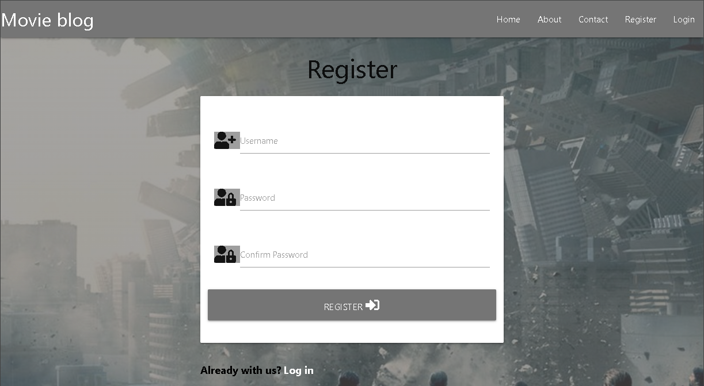
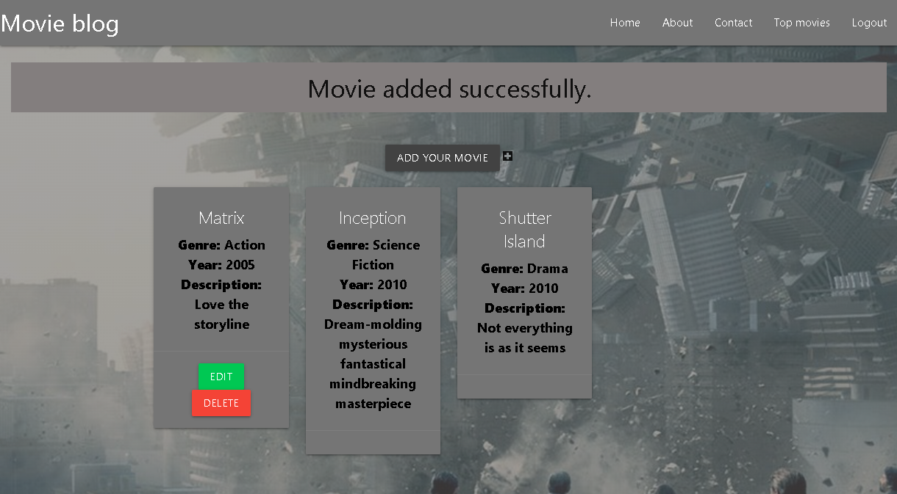
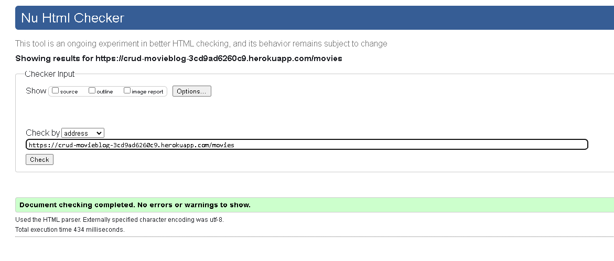

# CRUD movieblog

## Milestone Project 3

### I have created this web page as a part of  my Milestone Project 3 for educational purposes only

## Live Project

[Live Webpage](https://crud-movieblog-3cd9ad6260c9.herokuapp.com/index)

## Repository

[My repository](https://github.com/EdgarKlavins/crud-movieblog)
 

# UX

### Project goals

The main purpose of this project is to create a user-friendly website with a Back end, designed to find and share movies, providing CRUD operations. (Create, Read, Update and Delete.)

## Project Goals
<ul>
<li>To create a website that can be navigated easily and intuitively.</li>
<li>To implement simple and clean design</li>
<li>To create a good looking website that responds correctly on all device sizes.</li>
<li>A website that has user authentication</li>
<li>A website that has user uuthorization</li>
<li>A website that is providing CRUD operations</li>
<li>A website which is linked to external database</li>
</ul>
 

## User Goals
<ul>
<li>Visually appealing design.</li>
<li>Links and buttons that work as expected</li>
<li>Quick and easy way to register</li>
<li>Simple and easy way to login</li>
<li>Ability to add, edit or delete own data</li>
<li>Being sure, that your data is protected</li>
<li>Accessibility.</li>
</ul>
 

## User stories
<ul>
<li>As a User, I want to know the purpose of the site immediately.</li>
<li>As a user, I want to view the website and content clearly on any device and resolution</li>
<li>As a user, I want to be able to easily register a new account.</li>
<li>As a user, I want an easy way to login</li>
<li>As a User, I want to add and share titles of my favourite movies</li>
<li>As a User, I want to be able to edit my posts or even delete them</li>
<li>As a User, I want to see, what movies other users are suggesting</li>
<li>As a User, I want to add and see, movie title, genre, year and comment section </li>
<li>As a user, I want to see contact information for the site owner in case I want to reach out </li>
<li>As a user, I want to be able to send messages directly through the website </li>
</ul>

## Design

### Wireframes

1. **Home page** displays the introduction and purpose of the website.

[Home page](documentation/readme/Home.png)

2. **About page** displays brief history of movie.

[About page](documentation/readme/About.png)

3. **Contact page** provides form with name, e-mail and message input.

[Contact page](documentation/readme/Contact.png)

4. **Register page** provides registry form.

[Register page](documentation/readme/Register.png)

5. **Add movie** Allows users to add, edit, delete movies or just browse other user movies

[Add movie page](documentation/readme/Addmovie.png)

### Database

In this case I have used one to many information flow, as you can see in the chart, I have two Primary keys and one Foreign key, 
 making movies related to user, who created them.

### CRUD

CRUD operations

1. Create

* Registeres and logged in users can create their own movie list

2. Read 

* Movies added by users can be easily viewed

3. Update 

* Logged in users can easily edit their own movies.

4. Delete

* Logged in users can delete their own movies.

### Flash messages

I have implemented flash message notifications using Jinja templating language.

User will get notification when:

* Creates a new account
* Gets logged in
* Creates new movie
* Movie gets edited
* Sends message in contact form
* Gets logged out
* If user name already exists
* If password or username is incorrect

### Colour scheme

As the main colour I chosed materialize built in class color "grey darken-1",  
which makes a good contrast with white and fits realy good with my background image and other tones of grey.

### Imagery

Images from "about" page are takken from https://www.scienceandmediamuseum.org.uk ,  
so as the informative text about movie beginnings

Background image link - from https://www.screenrant.com
 

## Features

### Existing Features

### All Pages

**Navigation Bar**

* Fully responsive; collapapses into a toggler menu on small devices;
* Features a logo which leads to the Index page when clicked;
* Features links to the Home, About, Contact pages;
* For users that are not logged in, it features links to the Register and Log In pages;
* For logged in users, it provides links to the Top movies and Log Out functionallity;
* Links are selected with darker grey colour  on hover.

 

**Footer**

* Contains credits and a link to the developer's Github and Linkedin accounts;

 

**Home page**

* Informs the user about the purpose of the website;
* Gives information how to access functionality.
* Shows recent activity of other users

 

**About page**

* Tells user a short introduction to history of movie creation;

 

**Contact page**

* Allows user to send message and leave contact data to receive an answer;

 

**Register page**

* Allows user to create account or if he  has it switch to login page;

 

**Login page**

* Allows user to log in or if he does not have an account switch to register page;

 

**Top movies page**

* Allows user to browse all already added movies;

 

* Allows user to add, edit or delete his/her movies ;

 

 

**Flash messages**

User gets flash message if:

* Creates a new account
* Gets logged in
* Creates new movie
* Movie gets edited
* Sends message in contact form
* Gets logged out
* If user name already exists
* If password or username is incorrect

 

# Testing

### HTML

* Home page

 

* About page

* Contact page

* Register page

* Login page

* Movies page

 
 

### CSS

 
 

### Python

Python files were checked through the Python linter.

* Routes.py

 

* Models.py

 
 

### Lighthouse

I used lighthouse extension for my Chrome browser

### Testing user stories

1. As a User, I want to know the purpose of the site immediately.

User lands on index page, where is all required information

Home Page

 

2. As a user, I want to view the website and content clearly on any device and resolution

Website has been tested on different resolutions and different browsers:

| Google Chrome | Opera | Microsoft Edge |
|:-------------:| :----:| :------------: |
| Pass | Pass | Pass |

3. As a user, I want to be able to easily register a new account.

Register page is simplified and accessable as soon as a new user lands the page

Register Page

 

4. As a user, I want an easy way to login

Same as register page, login page is accessable as soon as a new user lands the page

Login Page

 

5. As a User, I want to add and share titles of my favourite movies

All user can add movies in Top movie section.

Movie added

 

6. As a User, I want to be able to edit my posts or even delete them

As long as user is logged in, all movies added by user are editable or delitable

Edit/Delete

 

7. As a User, I want to see, what movies other users are suggesting

All users logged in or not, can see recently added movie list at home page

Home

 

8. As a User, I want to add and see, movie title, genre, year and comment section

To add movie it is required to fill - movie title, genre, year and description sections
 

9. As a user, I want to see contact information for the site owner in case I want to reach out

Developer credentials and social network links are accessible any time and they are located on footer

Social links

 

10. As a user, I want to be able to send messages directly through the website

All users logged in or not can access Contact page and send messages

Contact

 

## Fetures planned to add in future

* Search bar to search and list movies by genre, year or title
* Safety measure, which asks to confirm before movie gets deleted

## Technologies Used

* HTML
* CSS
* Python
* Java Script

### Frameworks and tools

* Flask
* Jinja
* Materialize
* ElephantSQL
* Balsamiq
* Gitpod
* Github
* Werkzeug
* SQLAlchemy
* Heroku

 

### Known bugs

Bigest and hardest to detect bug was related to user and session ID's.
Where localy even logging in as a different user I was avle to edit and delete any entries. Only after printing in terminal each time after adding movie, I noticed that user and session ID always match, even with different accounts, it always was #3.

### Code used

All code is used from Code institute programm, appart from built in framework css classes.

## Deployment

### Forking the Github Repository
1. Open the Github repository at https://github.com/EdgarKlavins/crud-movieblog
2. Click on the fork button found in the top right corner.

### Creating a Local Clone
1. Open the Github repository at https://github.com/EdgarKlavins/crud-movieblog
2. Click on the Code button;
3. Choose to clone using either HTTPS, SSH, or Github CLI and click the copy button to copy the link address;
4. In a code editor, change the current working directory to the location desired for the cloned directory;
5. Type 'git clone' into the terminal and paste the link address copied earlier;
6. Press enter to create a local clone.

### Creating a Database with ElephantSQL
1. Log in with GitHub to the ElephantSQL.
2. Create new team.
3. Click 'Create New Instance'.
4. Choose your plan.
5. Select your region.
6. Click 'Review'.
7. Click 'Create instance'.
8. Click on the name of your database and copy the URL to your clickboard.

### Creating a Heroku app
1. Type `pip3 freeze --local > requirements.txt` into the Gitpod terminal to create a requirements.txt file.
2. Type `echo web: python app.py > Procfile` into the terminal to create a Procfile.
3. Commit and push the changes to Github.
4. Login to your Heroku Account.
5. Click 'New' -> 'Create new app'.
6. Enter a name for your project and select your region.
7. Click 'Create app'.
8. Go to 'Settings', click 'Reveal Config Vars'.
9. Add the following variables:
    * DATABASE_URL: your ElephantSQL database url
    * IP: 0.0.0.0
    * PORT: 5000
    * SECRET_KEY: your secret key
    * DEBUG: True
10. Click on the 'Deploy' tab.
11. Click 'Connect to Github'.
12. Find your depo and click 'Connect'
13. Click 'Deploy Branch'.
14. Click 'More' -> 'Run console'
15. Type in `python3`
16. Type `from taskmanager import db` -> `db.create_all()` -> `exit().`
17. Click 'Open App'.

## Acknowledgements

I would like to express my gratitude to:

* My tutor, Ben from City of Bristol College, for always being helpfull and patient
* My friends testing the website on their devices.

